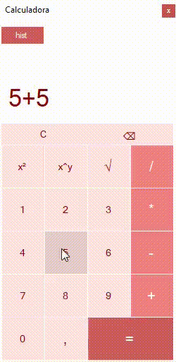

<h1 align="center">Calculadora</h1>
<h1 align="center">
    
    
</h1>

##                

## 🔖 Sobre
Uma calculadora que realiza operações matemáticas básicas, registra um histórico e permite input atráves do teclado.
## 🚀 Tecnologias
- C#
